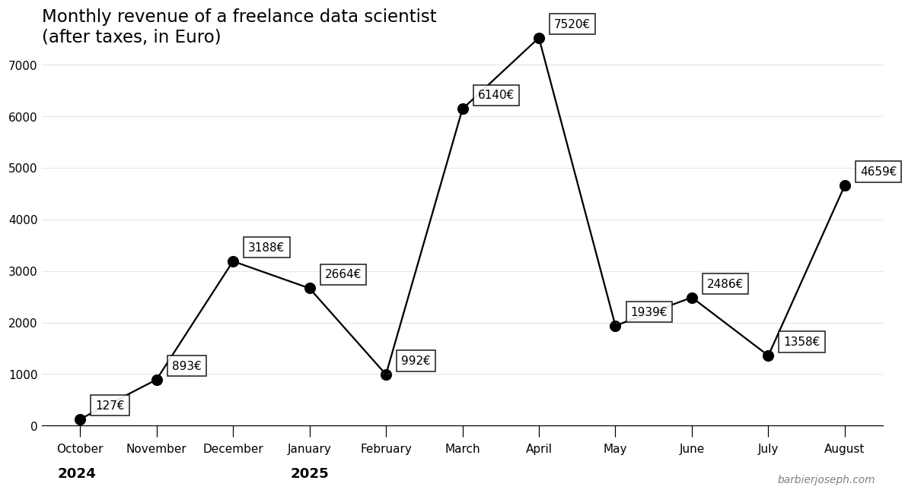

# Lessons after one year of data science freelancing

Estimated read time: 3 min

## Intro

About a year ago, I did my last internship and officially finished my master in applied maths. I had a bit of money on the side and [Yan Holtz](https://www.yan-holtz.com/) asked me if I wanted to create an online course on matplotlib with him. The 2 options were:

- apply for jobs (I did a few interviews)
- start freelancing, create the course with Yan and look for clients

Since I feel like I had nothing to lose, I decided to go freelance and look for a regular job if I don't have money anymore. I'll start by describing the upsides (money, workload, etc) of this decision, and then the downsides.

I knew I'd be able to make a minimum amount of money which would have let me around a full year combined with my savings. My idea was to work on side projects / open source if I didn't have any client to work for.

It turns out to be **the best experience** I could have imagined.

Yan and I created [the course](https://www.matplotlib-journey.com/) (where I learned **a lot** about building and selling a product). We're still working on it, but most of the work is now done, students are happy and I now have a "passive" income (not 100%, but I don't believe such things really exist).

At the same time, I met [David Keyes](https://dgkeyes.com/) via a post on LinkedIn saying he was looking for someone to write blog posts about dataviz. I've been working for him since then (almost a year now!), on many projects, as a consultant. I learn(ed) a lot, met other freelancers working for him and plan to continue to grow with him and his new company [Clarity Data Studio](https://claritydatastudio.com/).

And then other people I met along the way or just contacted me offered me to work with them, which I am very grateful for.

## Upsides

#### Money

Since that's the thing most people (including myself) are the most interested in, I want to share exact figures.

> _To get in USD, as of the day I'm writing this, you need to multiply 1.16._

To be honest, I earned significantly more money than I was expecting.

At the same time, you can see that there is **no pattern**. Even I realized I'm pretty bad at estimating how much I'll earn next month. Also, the first 2 months were not enough for me to cover my spending. If I didn't have savings, I couldn't have started this project.

#### Remote

At the moment, I've only worked 100% remotely and asynchronously. That means I work whenever I want and wherever I want, which is an amazing thing.

One of the great things here is that it works because I work with people that trust me. My clients don't care about what I do during my day while I'm doing the job. I believe it makes me enjoy and care more about the work I'm doing.

I also have very few calls (between 1 and 3 per week). They last around 20 minutes on average.

#### Workload

It's very hard for me to estimate how much I work on average. And since I spend a significant amount of time doing open source work (e.g., not for clients), I need to take that into account.

I do believe that if I only take freelance work into account and if I wanted to, I could easily fit everything into a **9 to 4 (6 hours per day), Monday to Friday**, with many weeks off over the year. If I include open source work, I think it would be more a **9 to 6, Monday to Sunday**.

That means it's perfectly possible (in my case) to have a chill work life.

Finally, it's great to be able to randomly just not work on a Tuesday afternoon because your unemployed friend wants to go to a café.

#### Actual work

Last but not least, **I love what I'm doing**. I learn things literally every day, work with people that know so much more than me about so many different things (especially tech, business and communication).

I've started using tools I would have never expected to even hear about, and it makes me feel like I can just learn anything I want assuming I take the time. My job is really about learning how to use stuff and combine them with other stuff I already know.

I'm also super happy to be able to work on open source work (a small amount of it is paid work!), mostly on my own tools. But I'm planning to according more time to existing projects.

## Downsides

To be honest, I don't feel like there are major downsides. I still made a list because it's worth mentioning, but in my case, I'm overall very satisfied.

- If I don't have clients anymore, I don't have unemployment benefit contrary to most people where I live.
- It can be stressful to be responsible for making your clients happy. I don't stress much about it anymore.
- Sometimes I can have a very high amount of work and it's hard to predict when.
- Working fully remotely makes you solo most of the time (but that's easily solvable by working from cafés or coworking places).

## Takeaways

- Luck is very useful. I'm 100% sure I had more luck than average people. If I started over, I wouldn't expect the same results.
- A single person can have a MASSIVE impact on your life, and you **can't** predict it. Yan and David mentioned before are just two examples that changed the picture significantly in my case.
- Life is great

 
