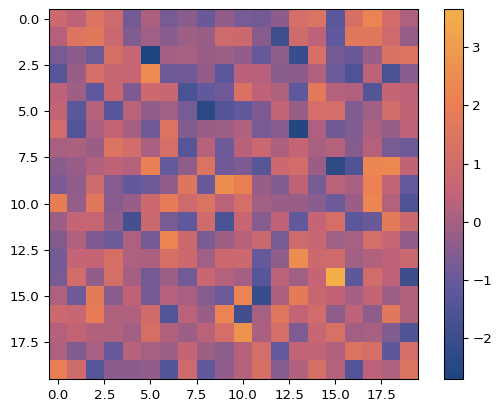
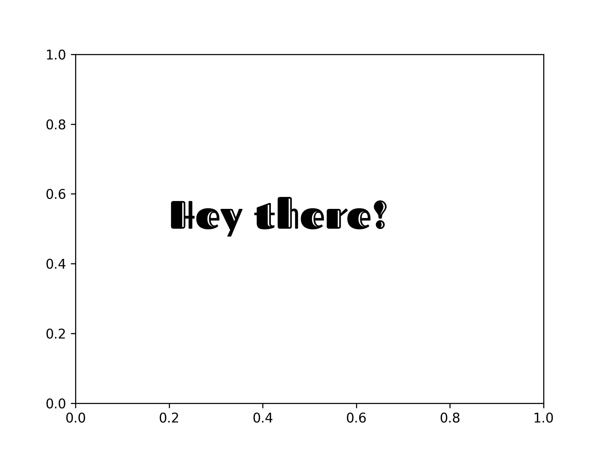
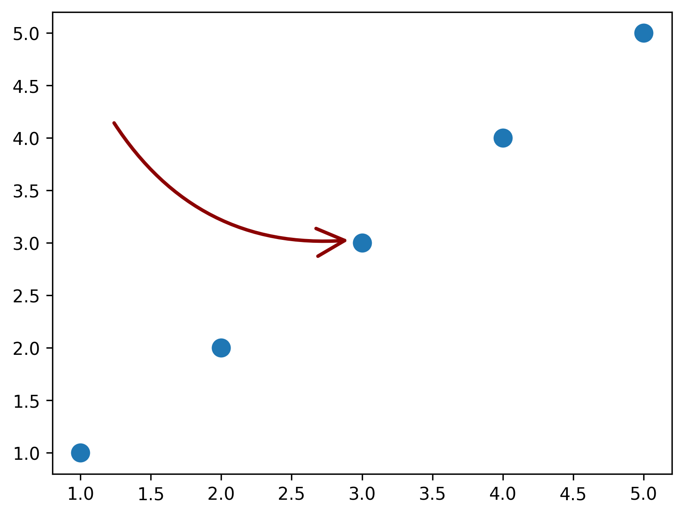
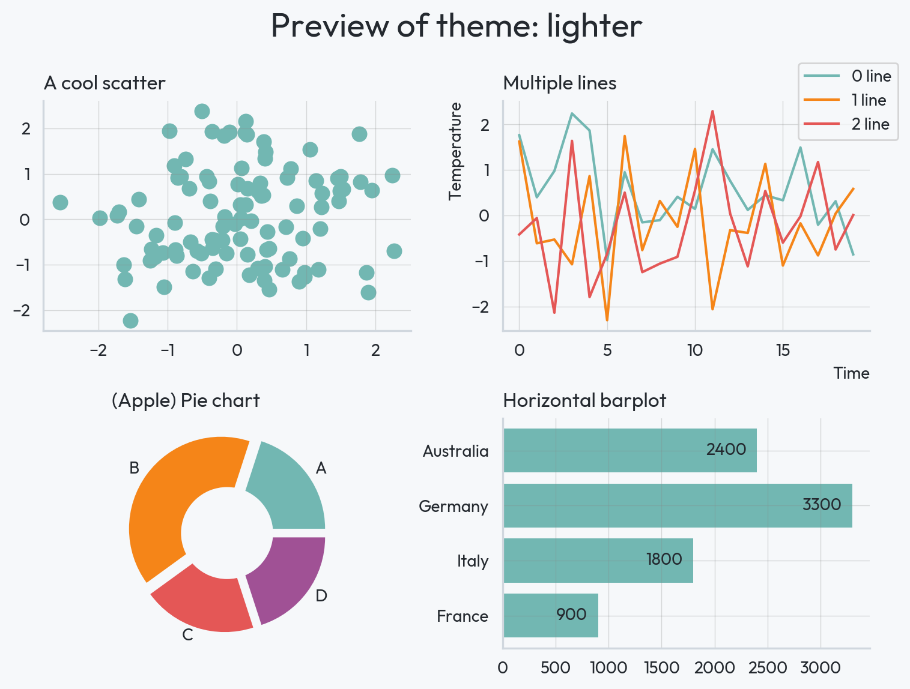
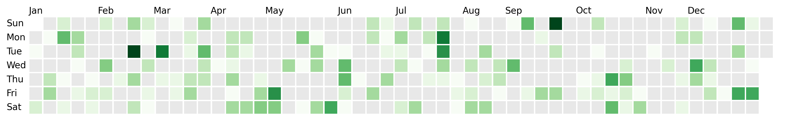

<center></center>

# Hi! I'm Joseph

I'm passionate about **open-source** development and **data analysis**. I live in France, working as a **freelance** data scientist and dedicating time to open-source projects.

<br>
<br>
<br>

### Work

#### Consulting

Most of my consultancy work focuses on **data science projects**, using Python or R. I also work with tools such as Quarto and React. My core expertise lies in data visualization though I handle a wide variety of projects for my clients.

#### Open source

I contribute to and maintain various packages, primarily in the **Python dataviz world**. My goal is to simplify data science tasks without compromising on extensive customization capabilities.

These projects are installed more than **50k times a month**.

=== "pypalettes"

      [pypalettes](https://github.com/JosephBARBIERDARNAL/pypalettes){:target="\_blank"}: a comprehensive collection (+2500) of colormaps for Python

      ```python
      import matplotlib.pyplot as plt
      import numpy as np

      from pypalettes import load_cmap

      cmap = load_cmap("Sunset2", cmap_type="continuous")

      data = np.random.randn(20, 20)

      plt.imshow(data, cmap=cmap)
      plt.colorbar()
      ```

      <center></center>

=== "pyfonts"

      [pyfonts](https://github.com/JosephBARBIERDARNAL/pyfonts){:target="\_blank"}: working with fonts in Matplotlib, enhancing ease and reproducibility

      ```python
      import matplotlib.pyplot as plt
      from pyfonts import load_google_font

      font = load_google_font("Fascinate Inline")

      fig, ax = plt.subplots()
      ax.text(
          x=0.2,
          y=0.5,
          s="Hey there!",
          size=30,
          font=font
      )
      ```

      <center></center>

=== "drawarrow"

      [drawarrow](https://github.com/JosephBARBIERDARNAL/drawarrow){:target="\_blank"}: simplifies the process of customizing arrows in Matplotlib (which is harder than you think)

      ```python
      import matplotlib.pyplot as plt
      from drawarrow import fig_arrow

      fig, ax = plt.subplots()

      ax.scatter([1, 2, 3, 4, 5], [1, 2, 3, 4, 5], s=100)

      fig_arrow(
          head_position=(0.5, 0.5),
          tail_position=(0.2, 0.7),
          width=2,
          radius=0.3,
          color="darkred",
          fill_head=False,
          mutation_scale=2,
      )

      plt.show()
      ```

      <center></center>

=== "morethemes"

      [morethemes](https://github.com/JosephBARBIERDARNAL/morethemes){:target="\_blank"}: themes for Matplotlib (one line for beautiful graphs)

      ```python
      import morethemes as mt

      mt.set_theme("lighter")
      mt.preview_theme() # generate a bunch of charts
      ```

      <center></center>

=== "dayplot"

      [dayplot](https://github.com/JosephBARBIERDARNAL/dayplot){:target="\_blank"}: calendar heatmaps in Matplotlib

      ```python
      import matplotlib.pyplot as plt
      import dayplot as dp

      df = dp.load_dataset()

      dp.calendar(
          dates=df["dates"],
          values=df["values"],
          start_date="2024-01-01",
          end_date="2024-12-31",
      )
      ```

      <center></center>

=== "gifing"

      [gifing](https://github.com/y-sunflower/gifing){:target="\_blank"}: makes creating GIFs straightforward and effortless.

<br>
<br>
<br>
